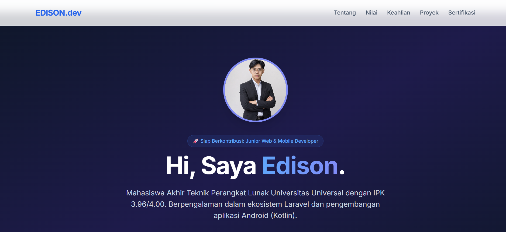

# 🚀 Web Portofolio Profesional

Repositori ini berisi kode sumber untuk website portofolio profesional saya. Website ini berfungsi sebagai alat distribusi branding yang merangkum data diri, keahlian teknis, sertifikasi, serta rekam jejak proyek saya selama masa perkuliahan.

### 📸 Tampilan Preview Web
<p align="center">
  
</p>

### 👤 Profil Mahasiswa
* **Nama:** Edison
* **Program Studi:** S1 Teknik Perangkat Lunak (Software Engineering)
* **IPK Kumulatif:** 3.96 / 4.00
* **Institusi:** Universitas Universal, Batam
* **Live Website:** [ghedi.github.io/edison-portfolio/](https://ghedi.github.io/edison-portfolio/)

### 🛠️ Tech Stack & Peralatan
* **HTML5** - Arsitektur struktur semantik web yang bersih dan SEO-friendly.
* **Tailwind CSS (via CDN)** - Framework CSS modern untuk penyusunan UI responsif dan estetik.
* **Google Fonts (Inter)** - Optimalisasi tipografi profesional.

### 💻 Cara Menjalankan Project secara Lokal
1. Melakukan clone repositori ini ke komputer lokal Anda:
   ```bash
   git clone [https://github.com/GHedi/edison-portfolio.git](https://github.com/GHedi/edison-portfolio.git)
